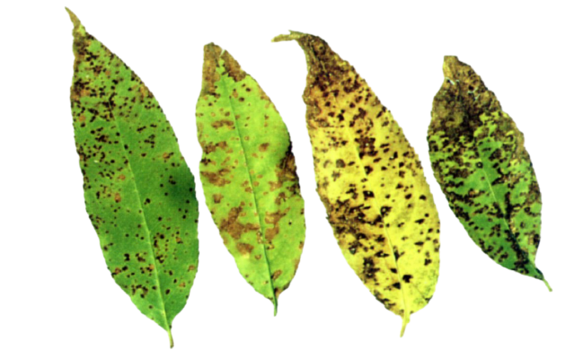
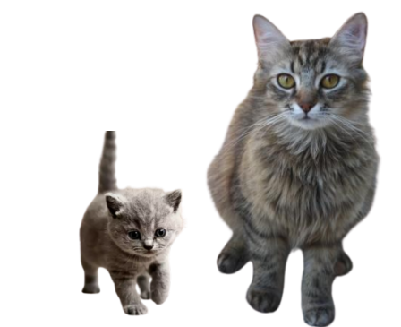

# Project Assignment(EC351)

Implementation of Real-time applications of Sorting Algorithms in image processing under the guidance of Dr. Uma Sheshadri. 

[Project Documentation]()

## Extra Applications Implemented

### Identification of Infected leaves ( Sorting Based on dominant color )

Sorting images using colour content in images is very useful in image processing . Using the colortheif library of python we can caluculate the dominant color present in the image.Using this concept of dominant colour we can catogorize leafs based on the color content of brown spots present on the leafs. If the brown color content is more in the image then its mean value of RGB will be less because rgb value of Brown is (39.6, 26.3, 12.9) and rgb value of greeen is (58, 95, 11).In this way we can indentify infected leafs .

Check out the code: [Here](https://github.com/P-Chandana/EC351_Algorithms_Virtual_Hackathon/blob/main/Sorting_by_color.py)

### Sorting and Searching cats according to their ages 

**Python Libraries used** : OpenCV ,PIL ,Numpy ,Matplotlib ,glob ,collections ,colortheif 

